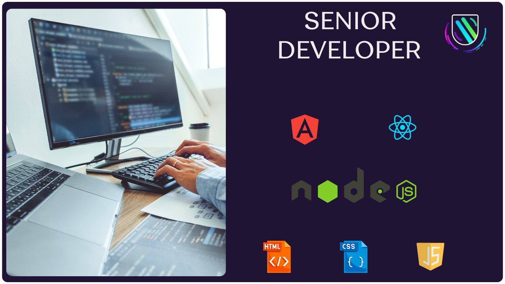

<h1 align="center"> Hi there 👋, I'm cristopher martinez</h1>

<pre>
🖥️ Full Stack Developer with a focus on MEAN/MERN Stack | Passionate about leveraging new technologies
📚 Holds a Certificate in Web Development
✏️ Excels in crafting dynamic UIs for applications on the Frontend
🛠️ Currently immersed in developing applications using MEAN/MERN Stack, including MongoDB, Express.js, Angular/React, and Node.js
🌱 Dedicated to understanding customer needs and enhancing user experience
🌟 Proficient in Javascript for both Frontend and Backend
🚩 Enthusiastic about Full Stack Application development
</pre>

## HTML, CSS, and Front-end

- 
- 
- 
- 
- 
- 
- 
- 

## Backend and Server

- 
- 
- 

## Package Managers and Build Tools:

- 
- 

## Databases

- 

## Deployment and Hosting:

- 
- 
- 

## Other Tools:

- 

  <h3><b>Let's get in touch! </b></h3>
  

  

  

